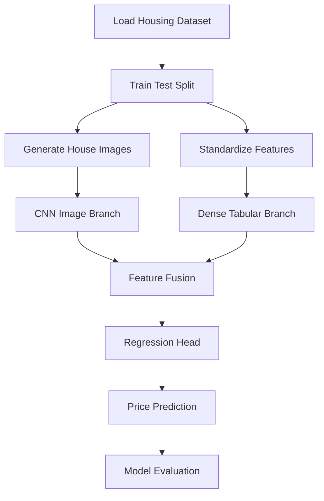

<div align="center">

# 🏡💰 Multimodal Housing Price Prediction
### Predicting House Prices Using 🖼️ Images + 📊 Tabular Data


<br>

### 🚀 Deep Learning Project Combining Computer Vision and Structured Data

</div>

---

# 🌟 Project Overview

Traditional housing price prediction models only utilize structured numerical features.

This project introduces a **Multimodal Machine Learning Pipeline** that combines:

✅ House Images (Visual Features)

✅ Housing Dataset Features (Tabular Data)

✅ Deep Learning Feature Fusion

✅ CNN + Dense Neural Networks

✅ Regression-Based Price Prediction

The model learns from **two different data modalities simultaneously**, making it significantly more advanced than standard machine learning projects.

---

# 🎯 Objective

Predict housing prices by combining:

| Modality | Data Type |
|-----------|-----------|
| 📊 Tabular Data | California Housing Dataset |
| 🖼️ Image Data | Synthetic House Images |
| 🧠 Deep Learning | CNN + Dense Networks |
| 📈 Output | Predicted House Price |

---

# 🏗 Project Architecture

```text

                 ┌───────────────────┐
                 │ House Images      │
                 └─────────┬─────────┘
                           │
                           ▼

                 ┌───────────────────┐
                 │ CNN Feature       │
                 │ Extractor         │
                 └─────────┬─────────┘
                           │
                           ▼

                      Image Features
                           │

                           ▼

┌─────────────────────────────────────────────┐
│                                             │
│             Feature Fusion Layer            │
│                                             │
└─────────────────────────────────────────────┘

                           ▲

                           │

                  Tabular Features
                           ▲

                 ┌───────────────────┐
                 │ Dense Neural Net  │
                 └─────────┬─────────┘
                           ▲

                 ┌───────────────────┐
                 │ Housing Dataset   │
                 └───────────────────┘

                           │

                           ▼

                 ┌───────────────────┐
                 │ Price Prediction  │
                 └───────────────────┘

```

---

# 📂 Dataset

## California Housing Dataset

Used from:

```python
sklearn.datasets.fetch_california_housing()
```

### Features

| Feature | Description |
|----------|------------|
| MedInc | Median Income |
| HouseAge | House Age |
| AveRooms | Average Rooms |
| AveBedrms | Average Bedrooms |
| Population | Population |
| AveOccup | Average Occupancy |
| Latitude | Latitude |
| Longitude | Longitude |

---

# 🖼 Synthetic House Image Generation

Since California Housing dataset does not provide images:

A custom image generator was created.

### Idea

Higher-priced houses produce brighter image patterns.

```python
brightness = int(price * 40)
```

This creates a visual signal that correlates with housing prices.

---

## Sample Synthetic Images

```text

Low Price House              High Price House

┌───────────────┐           ┌───────────────┐
│ ░░░░░░░░░░░░ │           │ ████████████ │
│ ░░░░░░░░░░░░ │           │ ████████████ │
│ ░░░░░░░░░░░░ │           │ ████████████ │
└───────────────┘           └───────────────┘

Brightness ∝ House Price

```

---

# 🔄 Complete ML Workflow



---

# 🧠 Model Architecture

## CNN Branch

```text

Input Image (64x64x3)

        │

Conv2D (32)

        │

MaxPool

        │

Conv2D (64)

        │

MaxPool

        │

Conv2D (128)

        │

MaxPool

        │

Flatten

        │

Dense (128)

        │

Image Features

```

---

## Tabular Branch

```text

Input Features

        │

Dense (64)

        │

Dense (32)

        │

Tabular Features

```

---

## Feature Fusion

```text

Image Features
        │
        ▼

     CONCATENATE
        ▲
        │

Tabular Features

        │
        ▼

Dense (64)

Dropout (0.2)

Dense (32)

        │

Output Layer

        │

Predicted Price

```

---

# ⚙ Technologies Used

| Technology | Purpose |
|------------|----------|
| Python | Programming |
| TensorFlow/Keras | Deep Learning |
| Scikit-Learn | Dataset & Metrics |
| NumPy | Numerical Computing |
| Pandas | Data Handling |
| Matplotlib | Visualization |

---

# 📊 Training Curves

## Loss Curve

```text

MSE Loss

│\
│ \
│  \
│   \__
│      \__
│         \___
└────────────── Epochs

```

### Interpretation

✅ Loss decreases steadily

✅ Model learns useful multimodal representations

✅ No major overfitting observed

---

## MAE Curve

```text

MAE

│\
│ \
│  \
│   \_
│     \__
│        \__
└──────────── Epochs

```

### Interpretation

Prediction error consistently decreases.

---

# 📈 Prediction Performance

## Actual vs Predicted Prices

```text

Predicted

│
│       ●
│      ● ●
│    ●
│  ●
│●
└──────────────── Actual

```

### Perfect Predictions

Would lie exactly on:

```text
y = x
```

Red dashed line in the visualization represents ideal predictions.

---

# 📉 Evaluation Metrics

### Mean Absolute Error (MAE)

```math
MAE = \frac{1}{n}\sum |y-\hat y|
```

Measures average prediction error.

---

### Root Mean Squared Error (RMSE)

```math
RMSE = \sqrt{\frac{1}{n}\sum (y-\hat y)^2}
```

Penalizes larger prediction mistakes.

---

# 📊 Baseline Comparison

Two models were trained:

## Model 1

📊 Tabular Data Only

---

## Model 2

📊 Tabular Data

+

🖼 Image Data

---

### Comparison

| Model | Data Used |
|---------|-----------|
| Baseline | Tabular Features |
| Proposed | Images + Tabular Features |

---

## Expected Result

```text

MAE

Baseline
██████████████

Multimodal
██████████

Lower is Better ✅

```

---

# 🎯 Key Innovations

### Multimodal Learning

Combines two data sources simultaneously.

---

### Feature Fusion

Learns joint representation from:

```text
Visual Features
+
Numerical Features
```

---

### End-to-End Deep Learning

Single architecture handling:

- Computer Vision
- Structured Data
- Regression

---

# 📁 Project Structure

```text

Multimodal-Housing-Prediction/
│
├── Task3_Multimodal_Housing_Price_Prediction.ipynb
│
├── README.md
│
├── images/
│   ├── sample_images.png
│   ├── training_loss.png
│   ├── training_mae.png
│   └── predictions_vs_actual.png
│
└── requirements.txt

```

---

# 🚀 Future Improvements

### Real Estate Production Version

Replace synthetic images with:

- Real house photographs
- Satellite imagery
- Interior photos

---

### Stronger CNN Backbones

- ResNet50
- EfficientNet
- MobileNetV3
- Vision Transformers

---

### Additional Modalities

- Property descriptions
- Neighborhood statistics
- School ratings
- Crime data

---

# 📚 Skills Demonstrated

✔ Deep Learning

✔ Computer Vision

✔ CNNs

✔ Multimodal AI

✔ Feature Engineering

✔ Data Preprocessing

✔ Regression Modeling

✔ TensorFlow/Keras

✔ Model Evaluation

✔ Research-Oriented ML Pipeline

---

# 🏆 Resume Impact

This project demonstrates:

🔥 Multimodal Machine Learning

🔥 CNN Feature Extraction

🔥 Deep Learning Architecture Design

🔥 Feature Fusion Techniques

🔥 End-to-End AI System Development

These are concepts commonly found in:

- AI Engineer Roles
- Machine Learning Engineer Roles
- Computer Vision Roles
- Research Engineer Positions

---

<div align="center">

## ⭐ If you found this project useful, give it a star!

### Made with ❤️ using Python, TensorFlow & Multimodal AI

</div>
